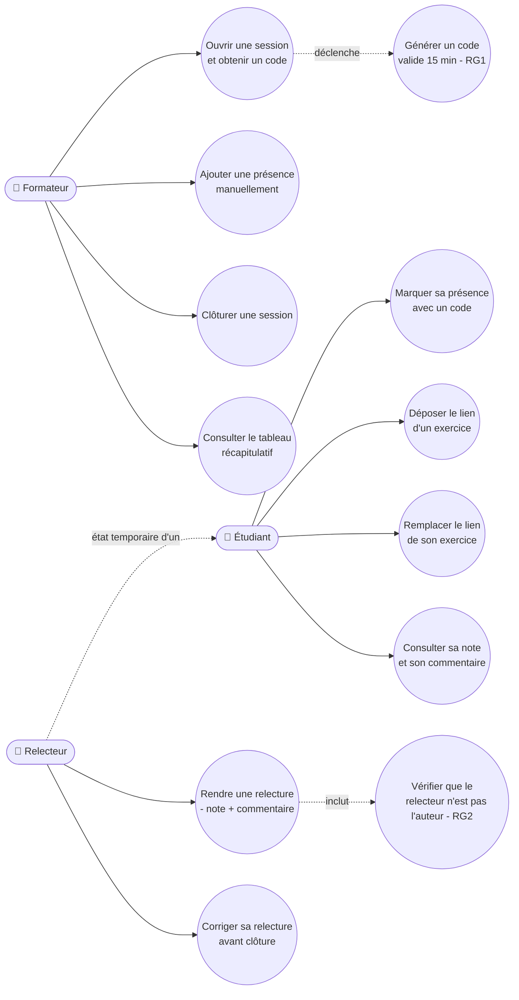

# D1 — Diagramme de cas d'utilisation

Ce diagramme montre les trois acteurs et ce que chacun peut faire. Le relecteur est représenté
comme une spécialisation temporaire de l'étudiant (voir section 2 du cahier des charges) :
il ne s'agit pas d'un compte distinct, mais d'un état attribué automatiquement pour un exercice donné.

## Correspondance avec le cahier des charges

| Cas d'utilisation | Exigence / Règle |
|---|---|
| UC1 — Ouvrir une session | EF1, RG1 |
| UC2 — Ajouter une présence manuellement | EF5, RG11 |
| UC3 — Clôturer une session | EF11, RG14 |
| UC4 — Consulter le tableau récapitulatif | EF12 |
| UC5 — Marquer sa présence | EF2, EF3, EF4, RG1, RG12, RG13 |
| UC6 — Déposer le lien d'un exercice | EF6, RG9 |
| UC7 — Remplacer le lien de son exercice | EF7, RG10 |
| UC8 — Consulter sa note et son commentaire | RG6 |
| UC9 — Rendre une relecture | EF8, EF9, RG2, RG4, RG5, RG3 |
| UC10 — Corriger sa relecture | EF10, RG7 |