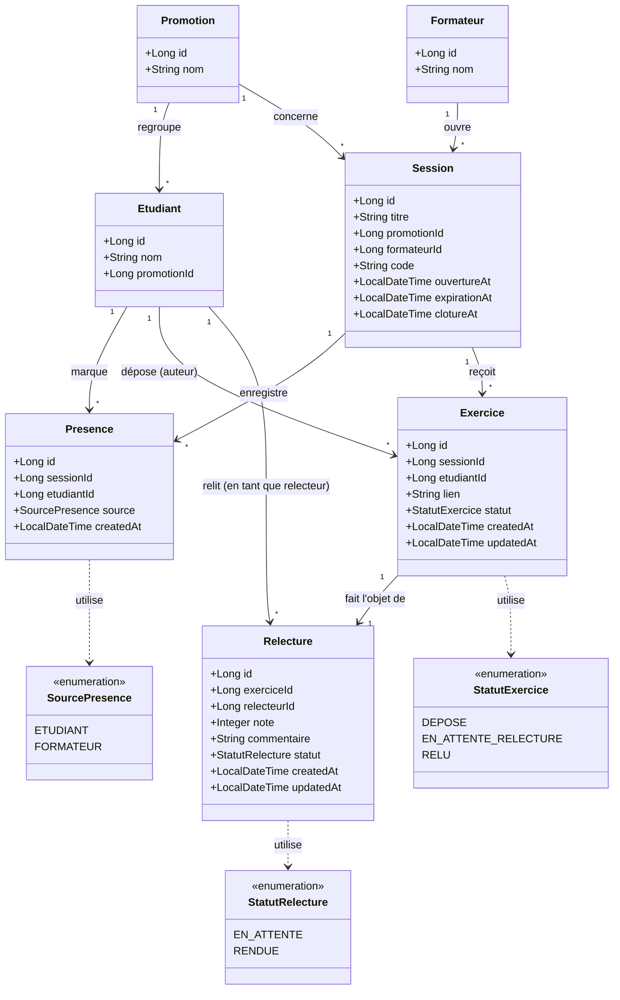

# D2 — Diagramme de classes / modèle de données

Ce diagramme doit correspondre exactement aux migrations Flyway du backend (B5). Toute
modification du schéma après l'étape 3 devra être répercutée ici, dans un commit qui l'indique.

## Notes de conception

- **`Relecture` est créée dès l'assignation** (au moment du dépôt de l'exercice), pas seulement à la
  réponse du relecteur — c'est ce qui permet à `RG8` (« l'exercice reste en attente tant que le
  relecteur n'a pas rendu sa relecture ») d'être vérifiable dans le tableau du formateur (`EF12`), même
  si le relecteur ne répond jamais.
- **Une contrainte d'unicité** `(session_id, etudiant_id)` sur `Presence` garantit `RG12` au niveau base
  de données, pas seulement en code métier.
- **Le relecteur (`Relecture.relecteurId`) référence `Etudiant.id`**, pas une table séparée : conformément
  à la décision de la section 2 du cahier des charges, le relecteur n'est pas un acteur distinct.
- **`Session.clotureAt`** (nullable) porte la règle `RG14` : tant qu'il est `null`, présences, dépôts et
  relectures restent modifiables.