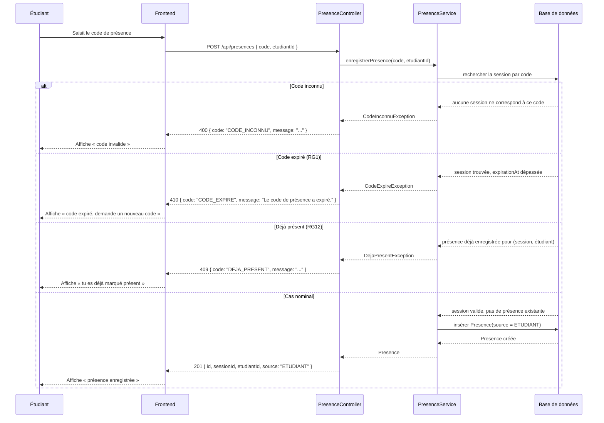

# D3 — Diagramme de séquence : « marquer sa présence »

Le cas nominal et trois cas d'erreur, alignés exactement sur les codes HTTP du contrat
(`api/contrat.yaml`, opération `POST /api/presences`).

## Correspondance avec le contrat et les règles

| Branche | Code HTTP | Code d'erreur | Règle de gestion |
|---|---|---|---|
| Code inconnu | 400 | `CODE_INCONNU` | déduit du contrat |
| Code expiré | 410 | `CODE_EXPIRE` | RG1 |
| Déjà présent | 409 | `DEJA_PRESENT` | RG12 |
| Cas nominal | 201 | — | EF2 |

*Le blocage après 5 échecs (RG13, Q4) n'est pas représenté ici : il concerne l'accumulation
d'appels successifs, pas un seul appel — il fera l'objet d'un diagramme d'état ou d'une note
séparée si nécessaire, pas d'une branche de cette séquence.*